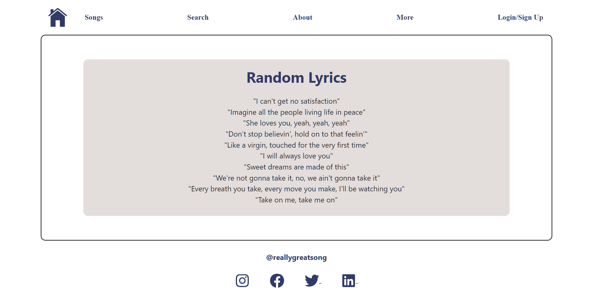

## Really Great Song
* It is a web app. Where the user search for lyrics of christian song.*
* Search and browse lyrics: Users can search for lyrics by song ID, song title, artist, or category. They can also browse a list of all available lyrics.
* View lyrics: Users can view the full lyrics of a selected song.
* User registration and login: Users can create accounts and log in. 
* Commenting: Users can leave comments on lyrics.
* Categorization: Lyrics can be organized into categories.
* Administration: Administrators can manage user accounts, lyrics, comments, and categories.

## Screenshot

## Tools, Framework and Language
* I am using HTML, CSS, JavaScript, React, and Bootstrap for Frontend.
* I will use Java Programming Language &  Spring Boot for REST API.
* I will be using the JUnit to test my controller method.
* I will be postman to test my Rest API.
* I will be using MYSQL Database.

## Connecting Frontend & Backend
* I will be Using Axios, a Javascript library, to communicate with the backend.
